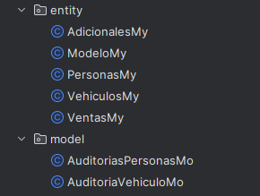
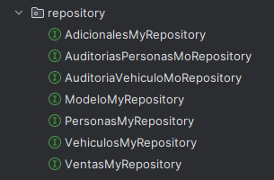

**Guía práctica del** 

**Caso de estudio 4: Concesionario con MongoDB**

Andrés Camilo Romero Camargo

Juan Camilo serrano Correa

David Alejandro Daza Cuervo

José Daniel Martínez Cáceres 

23 de septiembre del 2023

Universidad Pedagógica y Tecnológica de Colombia

Integración de Aplicaciones con Frameworks de Persistencia

**Requisitos previos para el desarrollo del proyecto:**

Antes de comenzar a desarrollar el aplicativo de gestión de concesionario en Java con la combinación de bases de datos MySQL y MongoDB, es importante asegurarse de tener en cuenta los siguientes requisitos previos:

- Conocimientos Básicos de Programación en Java:

Para trabajar en este proyecto, se espera que los desarrolladores tengan conocimientos fundamentales en programación en el lenguaje Java. Esto incluye la comprensión de conceptos como variables, estructuras de control, funciones y clases.

- Instalación y Configuración de MySQL:

MySQL será la base de datos relacional utilizada para almacenar cierta información del concesionario, como los detalles de clientes, vendedores y vehículos. Asegúrate de tener MySQL instalado y configurado correctamente en tu sistema antes de continuar. Puedes descargar MySQL desde el sitio oficial: https://dev.mysql.com/downloads/. Además, verifica que la base de datos MySQL esté en funcionamiento y accesible desde tu entorno de desarrollo.

- Instalación y Configuración de MongoDB:

MongoDB será la base de datos no relacional utilizada para almacenar las auditorías de las entidades del proyecto. Asegúrate de tener MongoDB instalado y configurado correctamente en tu sistema antes de continuar. Puedes descargar MongoDB desde el sitio oficial: https://www.mongodb.com/try/download/community. Además, es importante que la base de datos MongoDB esté en funcionamiento y accesible desde tu entorno de desarrollo.

- Herramienta de Desarrollo Java (IntelliJ):

Para escribir y compilar código Java, utilizaremos IntelliJ IDEA como nuestra herramienta de desarrollo principal. Asegúrate de tener IntelliJ IDEA instalado y configurado en tu sistema antes de continuar, debe tener en cuenta tener la licencia para trabajar sobre este programa, para este caso se usó una licencia de uso estudiantil. Puedes descargar IntelliJ IDEA desde https://www.jetbrains.com/idea/download/.

**Modelo Relacional Concesionario** 

Se pide general un modelo relación para gestionar los movimientos dentro de un concesionario de venta de vehículos ya sean nuevos o usados, donde se llevara acabo una auditoria que almacena el registro de todas las modificaciones que se realicen dentro de ella, este modelo relacional presentado a continuación será el exponente de toda la relación de la información presente dentro de ella.

Para realizar el modelo relacional de la base de datos concesionario se tendrán en cuenta los siguientes parámetros de funcionamiento dentro de esta:

- El concesionario dispone de un catálogo de vehículos definidos por su marca, modelo, cilindrada y precio.

- Cada uno de los modelos dispondrá de unas opciones adicionales (aire acondicionado, pintura metalizada, etc.). Las opciones vienen definidas por un nombre y una descripción. Hay que tener en cuenta que una opción puede ser común para varios modelos variando sólo el precio en cada caso.

- En cuanto a los clientes, la información de interés es el nombre, C.C., dirección y teléfono, lo mismo que para los vendedores.

- Los clientes pueden ceder su coche usado en el momento de comprar un vehículo nuevo. El coche usado vendrá definido por su marca, modelo, matrícula y precio de tasación. Es importante conocer la fecha en la que el cliente realiza esta cesión.

- Se desea saber qué vendedor ha vendido qué modelo a qué cliente. También la fecha de la venta y la matricula del nuevo vehículo. Es importante así mismo saber las opciones que el cliente ha elegido para el modelo que compra.

- Adicionalmente se desea almacenar la auditoría de cada una de las entidades de negocio.

Para que la base de datos cumpla cada uno de estos parámetros se plantearon las siguientes entidades con sus respectivos atributos. 

- **Entidad Personas:** Dentro de esta entidad tendremos la** información personal de cada una de las personas que hacen parte del concesionario sin importar si estos serán clientes o vendedores. 

- **Entidad Ventas:** Esta entidad contendrá toda la información sobre las ventas realizadas dentro del concesionario donde se tendrá en cuenta de manera detallada el vendedor y el cliente. 

- **Entidad vehículos:** Esta entidad contiene la información sobre los vehículos del concesionario dando algunas características de el donde su mayor aporte es indicar si el vehículo es nuevo o usado.

- **Entidad adicionales:** Cada uno de los vehículos puede llegar a tener aditamentos adicionales por ende la tabla adicionales contiene algunos aditamentos que puede llegar a incluir un vehículo dentro del concesionario. 

- **Entidad Modelo:** Esta indica el modelo de cada uno de los vehículos presentes dentro del concesionario.

En el modelo plateado se genero una relación muchos a muchos entre las entidades vehículos y adicionales, donde un vehículo puede tener un o varios adicionales como también una adicional puede estar en uno o varios vehículos por ende se crea la siguiente entidad débil que contendrá las llaves primarias de estas dos entidades ya nombradas.  

Ahora para dar cumplimento a cada uno de los parámetros planteados para el funcionamiento de la base de datos se generaron las relaciones entre cada entidad, logrando el siguiente modelo relacional para el caso de estudio “CONCESIONARIO”.

Cada una de las relaciones propuestas dentro del modelos dará satisfacción a los parámetros propuestos por el ejercicio. 

Este modelo relacional se contempla dentro del motor gestor de base de datos MySQL, el cual tendrá la base de datos con algunos ejemplos de registros cargados sobre ellos.

Con esto tendremos nuestra base de datos funcionando dentro del motor de base de datos. Ahora para realizar la auditoria de esta base de datos se va a realizar dentro de MongoDB. 

**Implementación MongoDB** 

El primer paso en el desarrollo del caso de estudio se generará por medio de Spring boot inicializar el cual se encuentra en el siguiente enlace (<https://start.spring.io/>),

Con ayuda de esta página web se crea la estructura del proyecto. para este fin también se agregarán dependencias de MySQL, MongoDB, Spring Data JPA y Spring Web.

¿Por qué usar dependencias?, en este caso las dependencias generadas desempeñan un papel fundamental en el proceso de desarrollo de aplicaciones, ya que son utilizados para establecer conexiones con bases de datos tanto relacionales como no relacionales. Esta conexión con las bases de datos es esencial para que la aplicación pueda almacenar y recuperar datos de manera eficiente con esto se generara la persistencia con Spring Data e hibernate.

Después de generar el archivo desde Spring boot inicializar, se descomprime el archivo.rar con el nombre del proyecto a manipular.

Posteriormente se abre el archivo del proyecto se debe dirigir al archivo ‘application.properties’ la cual se encuentra en la dirección ‘caso de estudio\src\main\resources’ como se muestra en la imagen.

` `

Dentro de este archivo, es imperativo incluir algunas líneas de código que serán de vital importancia para establecer la conexión con bases de datos tanto relacionales, como es el caso de MySQL, y no relacionales, como MongoDB. Esta acción es fundamental para garantizar el correcto funcionamiento de la aplicación y la interacción efectiva con diferentes sistemas de almacenamiento de datos.

En la línea número uno del archivo se configura el puerto que se utilizará para para las dos bases de datos, de las líneas dos a cinco se hace las configuraciones para la concesión con MongoDB, en estas se tiene, uri dirección de la base de datos, el host su puerto y la base de datos a la cual se conecta java, de igual manera entre las líneas siete y diez se realiza la conexión con MySQL, se debe tener en cuenta el usuario y su contraseña. 

Después de haber realizado las correcciones pertinentes se debe dirigir a la carpeta que contiene el archivo main de todo el programa, se debe tener en consideración que se trabaja con dos gestores de bases de datos relacional y no relacional, esto hace que sea que para efectos práctico se cree una estructura de archivos para cada uno.

En la anterior imagen se puede conocer la estructura utilizada para la MongoDB, si se compara las dos estructuras podemos encontrar similitudes en su estructura, pero con ligeros cambios en los nombres de modelo y entity así como resource y services. 

Con el fin de optimizar la gestión y el acceso a los datos, se llevará a cabo la creación de algunos archivos específicos en las carpetas compartidas tanto por MySQL como por MongoDB. Esta estrategia tiene como objetivo principal mejorar la eficiencia y la coherencia en la manipulación de la información almacenada en ambas bases de datos.

Con esto se busca tener una mejor comprensión de los archivos que se utilizan en cada gestor de base de datos. 

Se debe comenzar por realizar los archivos del modelo y entidades de Mongo y MySQL respectivamente, en ellos se crea una clase la cual contiene todos los campos de las tablas a crear junto con sus respectivos constructores y getter and setter.

A continuación se crean los archivos llamados repositorios que a diferencia del resto de archivos estos se crean como interfaces las cuales heredan atributos de ‘JpaRepository’ y ‘MongoRepository’  uno para MySQL y el otro para MongoDB respectivamente.

consecutivamente se crean los archivos de control o controladores, estos archivos son creados para poder realizar peticiones a las bases de datos

En esta imagen se puede apreciar la rutas de conexión para hacer peticiones a la base de datos, entre estas se encuentran peticiones para obtener datos eliminar y actualizar. 

En la imagen proporcionada se ilustra un proceso relevante en la gestión de bases de datos, específicamente en la integración de una base de datos no relacional utilizando MongoDB. En este contexto, se lleva a cabo la creación de esta base de datos, y se destaca la implementación de dos auditorías distintas que establecen relaciones entre personas y vehículos provenientes de la base de datos relacional previamente creada en MySQL

